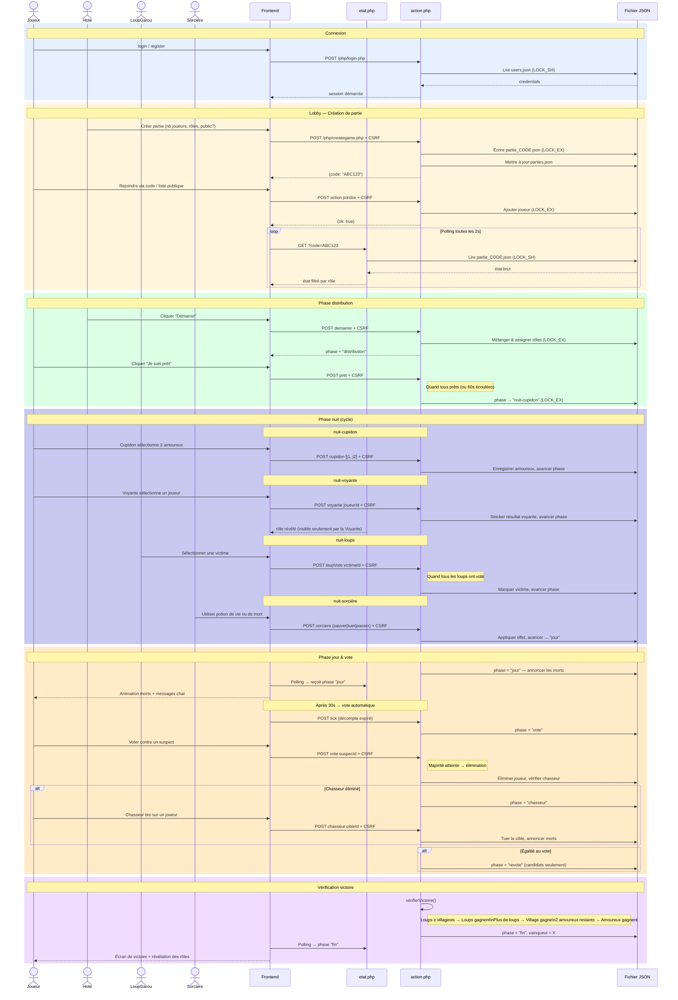

# Diagrammes — Loup-Garou

## 1. Diagramme de Cas d'Utilisation

```mermaid
graph TB
    subgraph Acteurs
        V[Visiteur]
        J[Joueur connecté]
        H[Hôte]
        LG[Loup-Garou]
        VO[Voyante]
        SO[Sorcière]
        CU[Cupidon]
        CH[Chasseur]
        PF[Petite Fille]
    end

    subgraph Authentification
        UC1(S'inscrire)
        UC2(Se connecter)
    end

    subgraph Lobby
        UC3(Créer une partie)
        UC4(Rejoindre une partie publique)
        UC5(Rejoindre via code)
        UC6(Annuler une partie)
        UC7(Consulter la liste des parties)
    end

    subgraph Déroulement de partie
        UC8(Choisir ses amoureux)
        UC9(Investiguer un joueur)
        UC10(Voter pour dévorer)
        UC11(Utiliser potion de vie)
        UC12(Utiliser potion de mort)
        UC13(Espionner les loups)
        UC14(Voter pour éliminer)
        UC15(Tirer sur un joueur)
        UC16(Voir l'état de jeu filtré)
        UC17(Envoyer un message chat)
        UC18(Démarrer la partie)
    end

    V --> UC1
    V --> UC2
    J --> UC3
    J --> UC4
    J --> UC5
    J --> UC7
    J --> UC16
    J --> UC17
    J --> UC14
    H --> UC6
    H --> UC18
    CU --> UC8
    VO --> UC9
    LG --> UC10
    SO --> UC11
    SO --> UC12
    PF --> UC13
    CH --> UC15

    H -.->|est aussi| J
    LG -.->|est aussi| J
    VO -.->|est aussi| J
    SO -.->|est aussi| J
    CU -.->|est aussi| J
    CH -.->|est aussi| J
    PF -.->|est aussi| J
```

---

## 2. Diagramme de Séquence — Partie complète

```mermaid
sequenceDiagram
    actor Joueur
    actor Hote
    actor LoupGarou
    actor Sorciere
    participant Frontend
    participant etat.php
    participant action.php
    participant Fichier JSON

    %% ── Connexion ──
    rect rgb(230, 240, 255)
        Note over Joueur, Fichier JSON: Connexion
        Joueur->>Frontend: login / register
        Frontend->>action.php: POST /php/login.php
        action.php->>Fichier JSON: Lire users.json (LOCK_SH)
        Fichier JSON-->>action.php: credentials
        action.php-->>Frontend: session démarrée
    end

    %% ── Création & Lobby ──
    rect rgb(255, 245, 220)
        Note over Joueur, Fichier JSON: Lobby — Création de partie
        Hote->>Frontend: Créer partie (nb joueurs, rôles, public?)
        Frontend->>action.php: POST /php/creategame.php + CSRF
        action.php->>Fichier JSON: Écrire partie_CODE.json (LOCK_EX)
        action.php->>Fichier JSON: Mettre à jour parties.json
        action.php-->>Frontend: {code: "ABC123"}

        Joueur->>Frontend: Rejoindre via code / liste publique
        Frontend->>action.php: POST action joindre + CSRF
        action.php->>Fichier JSON: Ajouter joueur (LOCK_EX)
        action.php-->>Frontend: {ok: true}

        loop Polling toutes les 2s
            Frontend->>etat.php: GET ?code=ABC123
            etat.php->>Fichier JSON: Lire partie_CODE.json (LOCK_SH)
            Fichier JSON-->>etat.php: état brut
            etat.php-->>Frontend: état filtré par rôle
        end
    end

    %% ── Distribution ──
    rect rgb(220, 255, 230)
        Note over Joueur, Fichier JSON: Phase distribution
        Hote->>Frontend: Cliquer "Démarrer"
        Frontend->>action.php: POST demarrer + CSRF
        action.php->>Fichier JSON: Mélanger & assigner rôles (LOCK_EX)
        action.php-->>Frontend: phase = "distribution"

        Joueur->>Frontend: Cliquer "Je suis prêt"
        Frontend->>action.php: POST pret + CSRF
        Note right of action.php: Quand tous prêts (ou 60s écoulées)
        action.php->>Fichier JSON: phase → "nuit-cupidon" (LOCK_EX)
    end

    %% ── Nuit ──
    rect rgb(200, 200, 240)
        Note over Joueur, Fichier JSON: Phase nuit (cycle)

        Note over Frontend, action.php: nuit-cupidon
        Joueur->>Frontend: Cupidon sélectionne 2 amoureux
        Frontend->>action.php: POST cupidon [j1, j2] + CSRF
        action.php->>Fichier JSON: Enregistrer amoureux, avancer phase

        Note over Frontend, action.php: nuit-voyante
        Joueur->>Frontend: Voyante sélectionne un joueur
        Frontend->>action.php: POST voyante joueurId + CSRF
        action.php->>Fichier JSON: Stocker résultat voyante, avancer phase
        etat.php-->>Frontend: rôle révélé (visible seulement par la Voyante)

        Note over Frontend, action.php: nuit-loups
        LoupGarou->>Frontend: Sélectionner une victime
        Frontend->>action.php: POST loupVote victimeId + CSRF
        Note right of action.php: Quand tous les loups ont voté
        action.php->>Fichier JSON: Marquer victime, avancer phase

        Note over Frontend, action.php: nuit-sorcière
        Sorciere->>Frontend: Utiliser potion de vie ou de mort
        Frontend->>action.php: POST sorciere {sauver|tuer|passer} + CSRF
        action.php->>Fichier JSON: Appliquer effet, avancer → "jour"
    end

    %% ── Jour & Vote ──
    rect rgb(255, 235, 200)
        Note over Joueur, Fichier JSON: Phase jour & vote
        action.php->>Fichier JSON: phase = "jour" — annoncer les morts
        Frontend->>etat.php: Polling → reçoit phase "jour"
        Frontend-->>Joueur: Animation morts + messages chat

        Note over Frontend, action.php: Après 30s → vote automatique
        Frontend->>action.php: POST tick (décompte expiré)
        action.php->>Fichier JSON: phase = "vote"

        Joueur->>Frontend: Voter contre un suspect
        Frontend->>action.php: POST vote suspecId + CSRF
        Note right of action.php: Majorité atteinte → élimination
        action.php->>Fichier JSON: Éliminer joueur, vérifier chasseur

        alt Chasseur éliminé
            action.php->>Fichier JSON: phase = "chasseur"
            Joueur->>Frontend: Chasseur tire sur un joueur
            Frontend->>action.php: POST chasseur cibleId + CSRF
            action.php->>Fichier JSON: Tuer la cible, annoncer morts
        end

        alt Égalité au vote
            action.php->>Fichier JSON: phase = "revote" (candidats seulement)
        end
    end

    %% ── Fin ──
    rect rgb(240, 220, 255)
        Note over Joueur, Fichier JSON: Vérification victoire
        action.php->>action.php: vérifierVictoire()
        Note right of action.php: Loups ≥ villageois → Loups gagnent\nPlus de loups → Village gagne\n2 amoureux restants → Amoureux gagnent
        action.php->>Fichier JSON: phase = "fin", vainqueur = X

        Frontend->>etat.php: Polling → phase "fin"
        Frontend-->>Joueur: Écran de victoire + révélation des rôles
    end
```
